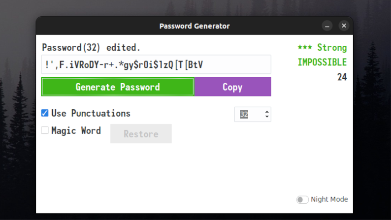
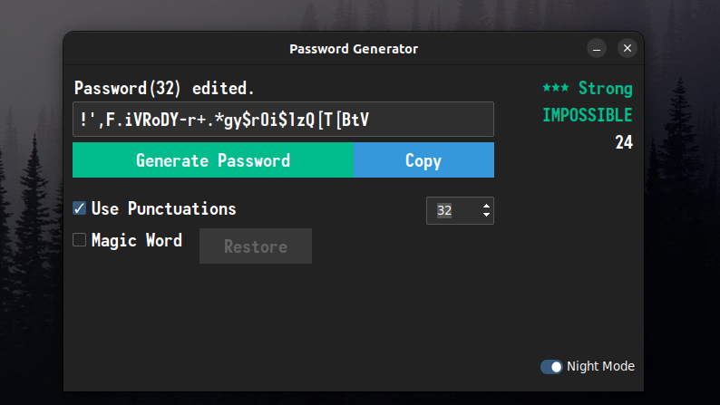

# Password Generator App

<div align="center">
  
  
</div>

Written in **Python**.

Used libraries:
- **tkinter**: A built-in Python library for creating graphical user interfaces (GUIs).
- **ttkbootstrap**: A themed widget set for Tkinter, providing a modern and customizable interface.
- **pyperclip**: A cross-platform Python module for clipboard manipulation.

**How to run?**
```bash
python main.py
```
